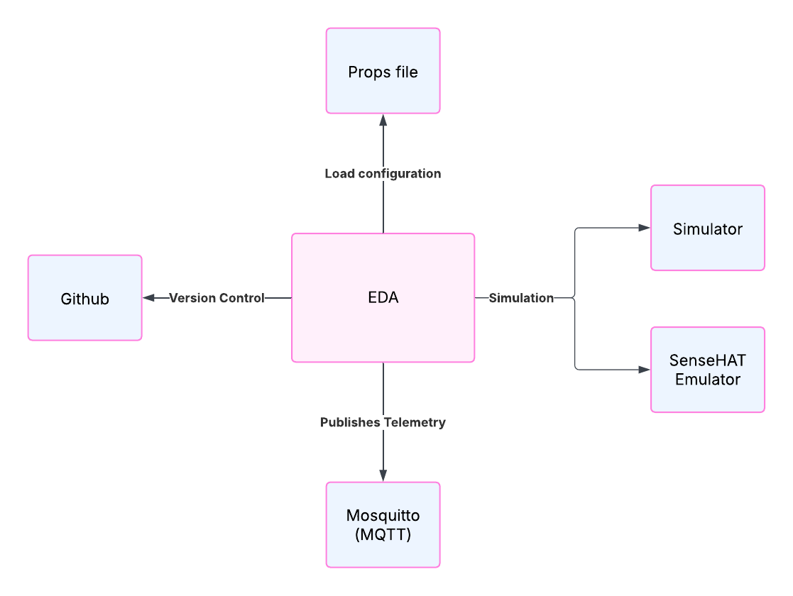

# Programming Digital Twins

## Lab Module 02 README.md

Be sure to implement all the requirements listed at [PDT-INF-02-001 - Lab Module 02](https://github.com/programming-digital-twins/pdt-exercise-tasks/issues/10).

### Description

INSTRUCTIONS: Describe, in your own words, the high-level functionality of this lab module by answering the questions listed below.

What does your implementation do? 

- EDA runs smoothly
- Tested Simulator, Sensor, Actuator on the EDA
- Installed and test SenseHAT Emulator integration 

How does your implementation work?

- EDA uses a .Props file to read configuration required to run itself in. Purpose of EDA is to replace a physical edge device eliminating the need of hardware to send data to the DTA. The EDA comes integrated with SenseHAT Emulator and a Data Simulator. The telemetry used is MQTT over Mosquitto.

### Design Diagram(s)

INSTRUCTIONS: Include one or more design diagram(s) representing your solution.

### Specific Features

INSTRUCTIONS: List the specific features implemented (or integrated) as part of this lab module. Preface each with either 'EDA' (for the Edge Device App) or 'DTA' (for the Digital Twin App). Keep each feature as concise as possible - e.g., 'EDA: Connects to MQTT broker' or 'DTA: Consumes EDA telemetry via MQTT'.

- Installed SenseHAT Emulator
- Tested successfully all data simulation and SenseHAT emulator integration logic
- EDA: Tested data translation and component integration successfully

EOF.
