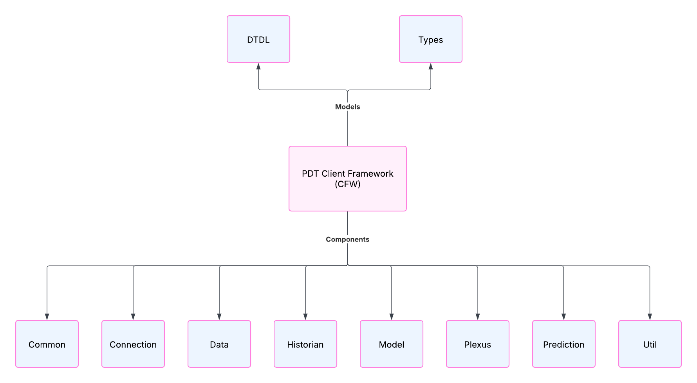

# Programming Digital Twins

## Lab Module 03 README.md

Be sure to implement all the requirements listed at [PDT-INF-03-001 - Lab Module 03](https://github.com/programming-digital-twins/pdt-exercise-tasks/issues/11).

### Description

INSTRUCTIONS: Describe, in your own words, the high-level functionality of this lab module by answering the questions listed below.

What does your implementation do? 
The LabBenchStudios PDT Unity Library was imported to the BuildingDigitalTwins Unity project as a package and some unmutable prefab components were tested. 

How does your implementation work?
N/A

### Design Diagram(s)

INSTRUCTIONS: Include one or more design diagram(s) representing your solution.

### Specific Features

INSTRUCTIONS: List the specific features implemented (or integrated) as part of this lab module. Preface each with either 'EDA' (for the Edge Device App) or 'DTA' (for the Digital Twin App). Keep each feature as concise as possible - e.g., 'EDA: Connects to MQTT broker' or 'DTA: Consumes EDA telemetry via MQTT'.

- DTA: Added basic scene components 
- DTA: Added LabBenchStudios-PDT-Unity package and added a prefab to the scene!

EOF.
