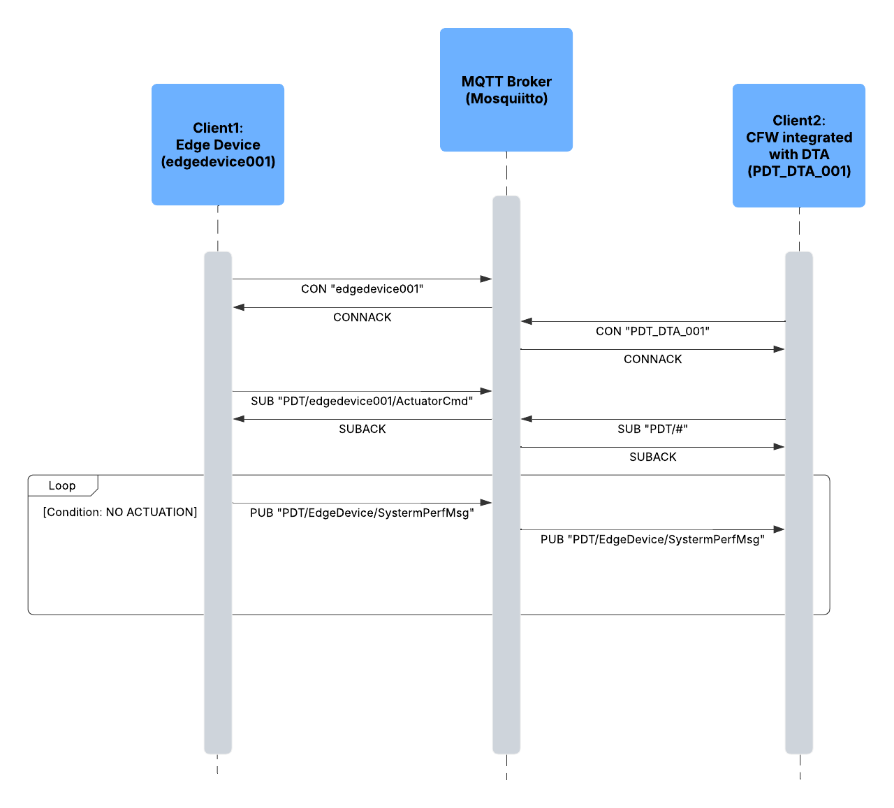

# Programming Digital Twins

## Lab Module 04 README.md

Be sure to implement all the requirements listed at [PDT-INF-04-001 - Lab Module 04](https://github.com/programming-digital-twins/pdt-exercise-tasks/issues/12).

### Description

INSTRUCTIONS: Describe, in your own words, the high-level functionality of this lab module by answering the questions listed below.

What does your implementation do? 

- Added an MQTT client to the EDA, and integrate with the CFW's MQTT client within the DTA.
- Used the existing DigitalTwinManager Prefab to synchronize the needed MQTT configurations between DTA(through CFW) and EDA.
- Added a Connection Status Panel to the DTA
- The EDA now successfully sends basic data payload from the EDA to the DTA via an Mosquitto MQTT broker.

How does your implementation work?
- The CFW component consists of an MQTT handler which after installing in the DTA(Unity), gives MQTT message handling capability to the DTA.
- The edge device (in this case: EDA) will then send data to a mutually agreed set of topics via an MQTT broker (in this case: Mosquitto).
- These messages then can be used as intended to reflect the real-time state of the asset and also actuate outputs as needed.

### Design Diagram(s)

### Specific Features

INSTRUCTIONS: List the specific features implemented (or integrated) as part of this lab module. Preface each with either 'EDA' (for the Edge Device App) or 'DTA' (for the Digital Twin App). Keep each feature as concise as possible - e.g., 'EDA: Connects to MQTT broker' or 'DTA: Consumes EDA telemetry via MQTT'.

- EDA: Connects to MQTT broker
- DTA: Connects to MQTT broker 
- DTA: Subscribes to topic
- EDA: Starts publishes messages to topic
- MQTT Broker: Relays the messages to all DTA
- DTA: Consumes EDA telemetry

EOF.
