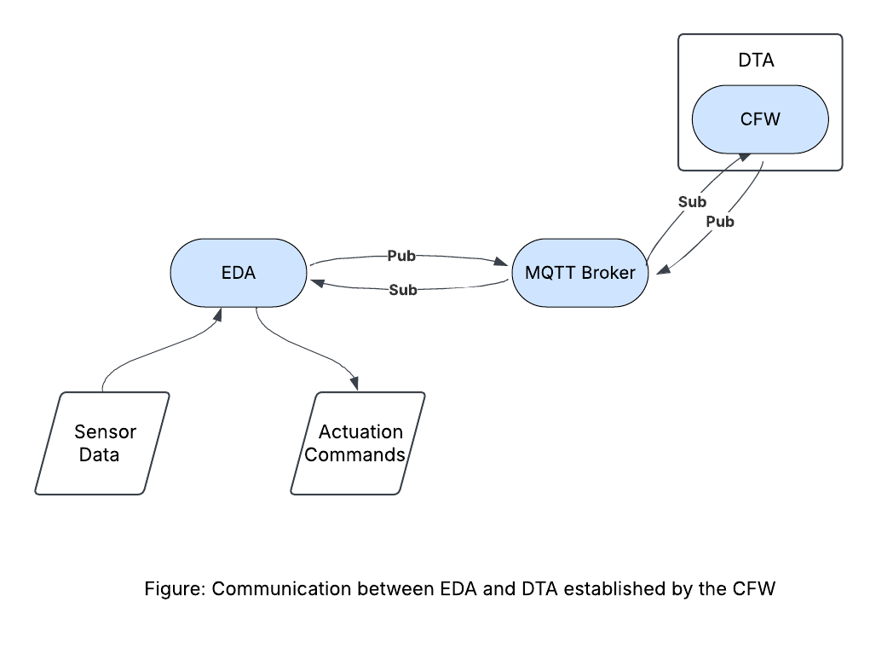

# Programming Digital Twins

## Lab Module 05 README.md

Be sure to implement all the requirements listed at [PDT-INF-05-001 - Lab Module 05](https://github.com/programming-digital-twins/pdt-exercise-tasks/issues/13).

### Description

INSTRUCTIONS: Describe, in your own words, the high-level functionality of this lab module by answering the questions listed below.

What does your implementation do? 
- Interaction with a Wind Turbine and a Heating System Prefab assets were achieved and verified using DTDL.
- A local LLM engine (Ollama) was installed and verified using RESTful APIs.

How does your implementation work?

- DTDL is used to ensure state synchronicity between the EDA and DTA.

### Design Diagram(s)

### Specific Features

INSTRUCTIONS: List the specific features implemented (or integrated) as part of this lab module. Preface each with either 'EDA' (for the Edge Device App) or 'DTA' (for the Digital Twin App). Keep each feature as concise as possible - e.g., 'EDA: Connects to MQTT broker' or 'DTA: Consumes EDA telemetry via MQTT'.

- CFW: Convert EDA's telemetry into DTDL
- DTA: Add DTDL support
- DTDL: Used as data representation for telemetry expressed between the EDA and DTA

EOF.
