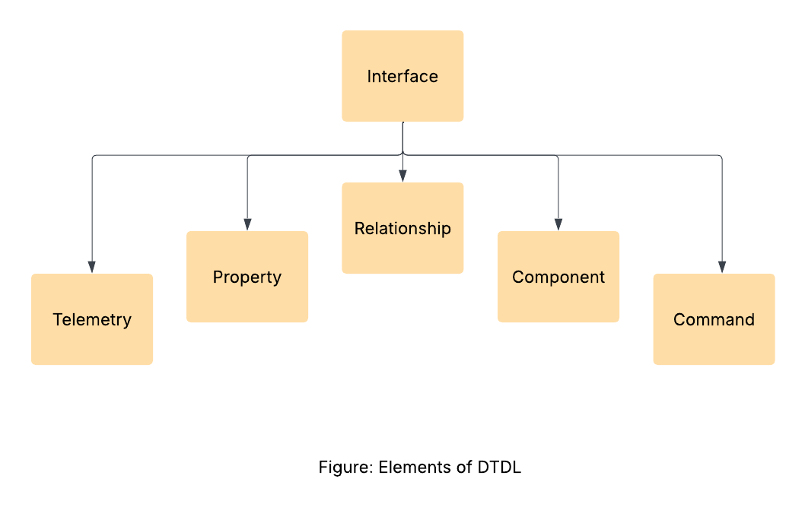

# Programming Digital Twins

## Lab Module 06 README.md

Be sure to implement all the requirements listed at [PDT-INF-06-001 - Lab Module 06](https://github.com/programming-digital-twins/pdt-exercise-tasks/issues/14).

### Description

INSTRUCTIONS: Describe, in your own words, the high-level functionality of this lab module by answering the questions listed below.

What does your implementation do? 
- Added a new interactive wall that displays and renders the EDA's telemetry.
- Exported the DTA scene using USD

How does your implementation work?
- The telemetry dashboard (interactive wall) is a GameObject which uses the "ThermostatControlAssembly" prefab to render and display the temperature readings sent by the EDA.

### Design Diagram(s)

### Specific Features

INSTRUCTIONS: List the specific features implemented (or integrated) as part of this lab module. Preface each with either 'EDA' (for the Edge Device App) or 'DTA' (for the Digital Twin App). Keep each feature as concise as possible - e.g., 'EDA: Connects to MQTT broker' or 'DTA: Consumes EDA telemetry via MQTT'.

- DTA: ThermostatControlAssembly prefab is attached to a Cube(Wall) GameObject.

EOF.
