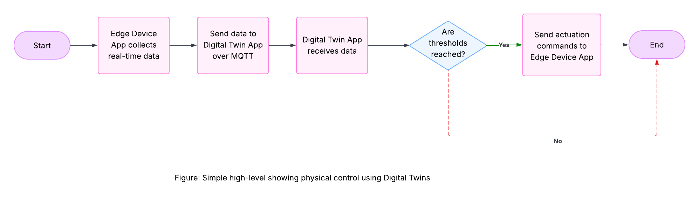

# Programming Digital Twins

## Lab Module 07 README.md

Be sure to implement all the requirements listed at [PDT-INF-07-001 - Lab Module 07](https://github.com/programming-digital-twins/pdt-exercise-tasks/issues/15).

### Description

INSTRUCTIONS: Describe, in your own words, the high-level functionality of this lab module by answering the questions listed below.

What does your implementation do? 

- Added and provisioned multiple thermostat virtual assets.
- Created a state and DTDL integration to custom asset using the 'DigitalTwinStateManager' prefab.
- Created the Thermostat asset prefab for easier "bundled" usability.
- Created and added a ThresholdAnimationHandler script to DTA to the custom asset that changes the color of asset according to programmable thresholds from the incoming sensor data.
- Created and added a ThresholdCommandHandler script to DTA to send an actuation command down to the edge device on certain programmable threshold crossings.

How does your implementation work?

- 'Digital Twin State Manager' prefab allows provisioning an asset to a particular edge device sending JSON data.
- It also handles DTDL integration: converting JSON sent by edge device to DTDL.
- Animation and command handler scripts will then monitor the incoming sensor data and take appropriate action accordingly.

### Design Diagram(s)

### Specific Features

INSTRUCTIONS: List the specific features implemented (or integrated) as part of this lab module. Preface each with either 'EDA' (for the Edge Device App) or 'DTA' (for the Digital Twin App). Keep each feature as concise as possible - e.g., 'EDA: Connects to MQTT broker' or 'DTA: Consumes EDA telemetry via MQTT'.

- DigitalTwinStateManager Prefab integration: Allows adding DTDL and state integration to any custom component and provisioning as well as data handling.
- ThresholdAnimationHandler Script Integration: Based on the sensor data received, the material colour can be updated to visually alert users of the system health. 

EOF.
