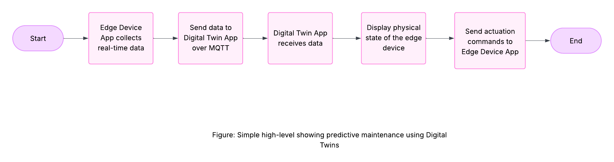

# Programming Digital Twins

## Lab Module 08 README.md

Be sure to implement all the requirements listed at [PDT-INF-08-001 - Lab Module 08](https://github.com/programming-digital-twins/pdt-exercise-tasks/issues/16).

### Description

INSTRUCTIONS: Describe, in your own words, the high-level functionality of this lab module by answering the questions listed below.

What does your implementation do?

- Added an additional EDA instance to send simulated Wind Turbine Data.
- Added Wind Turbine Power Generation Prefab to connect to the new EDA instance.
- Implemented a script that will gradually change colour of the battery charging for the Wind Turbine.

How does your implementation work?

- Visual representation in a controlled environment like in this Digital Twin app is the simplest, yet effective outputs. This can further be implemented to actuate the real-life assets.

### Design Diagram(s)

### Specific Features

INSTRUCTIONS: List the specific features implemented (or integrated) as part of this lab module. Preface each with either 'EDA' (for the Edge Device App) or 'DTA' (for the Digital Twin App). Keep each feature as concise as possible - e.g., 'EDA: Connects to MQTT broker' or 'DTA: Consumes EDA telemetry via MQTT'.

- DTA: captures telemetry and the script will compute state of the actual asset for example temperature, and based on pre-programmed thresholds, visualize the state.

EOF.
